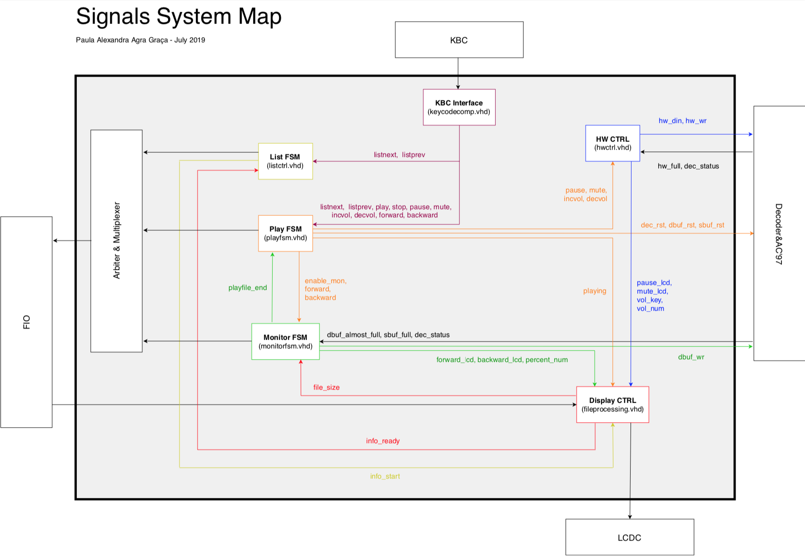
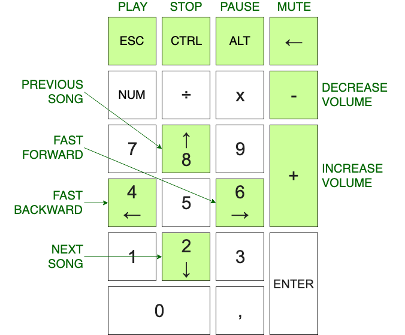
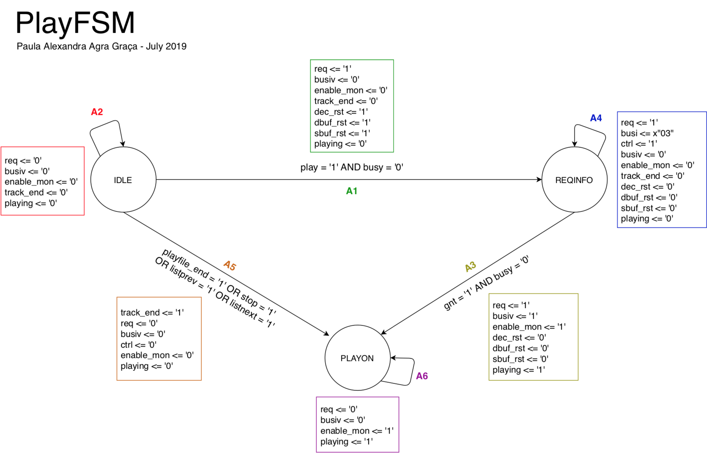
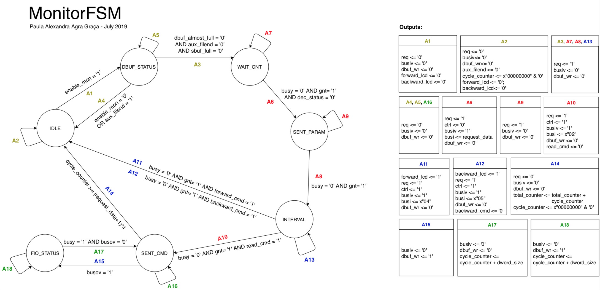

# MP3 Player - VLSI Design 🎧

- [Objective](#objective)
- [HDL Design](#design)
    - [User guide](#guide)
    - [Hardware](#hw)
    - [Finite State Machines](#fsm)

## Objective 
Design of a simple MP3 player that respects a **VLSI Design Flow** and uses **VHDL** as the hardware description language.

The goal is to implement it with a FPGA system, including the specification of timing constraints, pin assignment, synthesis, placement&routing (P&R), as well as bitstream generation.

## HDL Design 
All modules are interconnected, as represented in the **Signals System Map** below.

### User Manual 

The MP3 Player [User Manual](docs/MP3_user_manual.pdf) contains:
- the controller keys
- the available functions and features
- the expected LCD screen layout

### Hardware 
- Xilinx Virtex-II Pro XC2VP30-7FF896C FPGA (2448Kbit BRAM, 30816 logic cells)
- AC’97 audio chip
- Keypad (with PS/2)
- 16x2 LCD

### Finite State Machines 

FSM of **Play** subsystem, responsible for applying commands from the controller and stopping the data flow.

FSM of **Monitor** subsystem, responsible for aquiring music data and managing availability of other components (e.g.decoder).

